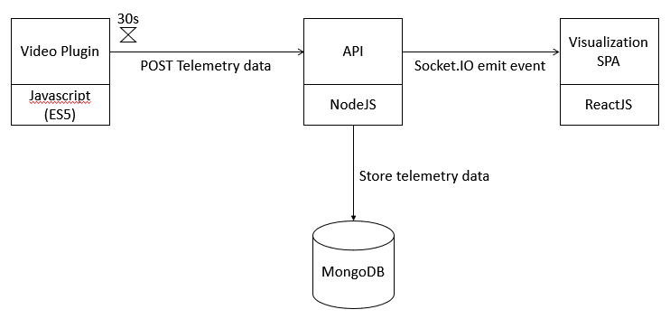

# AMP Telemetry Test

Solution for the task proposed: https://media-players.hivestreaming.com/docs/test_amp/docs/index.html.

The architectural pieces of the solution are represented in the following diagram:



## Getting Started

### Prerequisites

What software is needed to run this project:

- NodeJS and NPM (https://nodejs.org/)
- MongoDB (https://docs.mongodb.com/manual/administration/install-community/)

To manage the stored data I've been using:

- Studio 3T free trial (https://studio3t.com/)

### Instructions

These instructions will get you a copy of the project up and running on your local machine for development and testing purposes. This project has no automated tests or deployment builds and artifacts.

1. Clone the project into your working environment:

```
git clone git@github.com:Jpac7/amp-telemetry.git
```

2. Install the dependencies by running the next command inside the project main folder:

```
npm install
```

3. Run the API:

```
npm run api-dev
```

4. Open the index.html located in the src/plugin folder and it will start to generate telemetry data and send it to the api for storage. The collected data is also printed in the browser's dev console ("upload success" log).

5. Run the visualization client to visualize in real-time the data the API is receiving (This was done to get the bonus points! Although the styles are very basic - done only w/ bootstrap - it's possible to visualize telemetry data from every video currently playing in every browser tab):

```
npm run client-dev
```

6. Open the client in your browser: [http://localhost:1234](http://localhost:1234)

7. Use a mongoDB GUI client (like 'studio 3t') to check the data collected in the db (Db:'amp', Collection: 'streamings').

## Some remarks

- The plugin was written using ES5 features to avoid an extra transpilling phase.
- The telemetries default period is 30 seconds, but can be configured manually in the plugin options (src/plugin/index.html). Currently is manually set to 20sec.
- I'm starting the telemetry data collection as soon as the plugin is loaded and finishing when the 'ended' event is triggered.
- I'm capturing the first bitrate in the bitrates switches, when the playing begins.
- The telemetries objects are sent to a rest API, which sent them in real-time to all connected clients for visualization through socket.IO and saves them in the db. There is also an endpoint to retrive the telemetries but actually it isn't being used.
- There is a ReactJS client that can visualize the received telemetries in real-time from all video streamings happening. This client can also have multiple open instances.

## Images

DB structure


Client visualizing received telemetries


